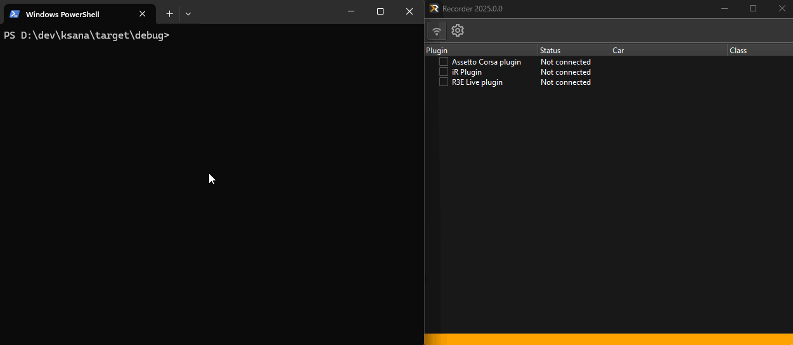

# ksana

<!-- cSpell:disable -->

*ξανά - "again" in Greek, pronounced /ksaˈna/*

<!-- cSpell:enable -->

This is a rewrite of https://github.com/race-engineering-center/shm-debugger in
Rust 🦀

`ksana` is a CLI tool for working with telemetry streams from racing simulators.
The dumper samples raw telemetry data at a given frequency and stores it on disk
in a compressed format. The player replays previously recorded sessions by
streaming data back to consumers as if it was coming directly from the
simulator. This can be used for reproducible debugging of various tools that
rely on shared memory as well as reading files saved by dumper directly to
enable unit testing.

Originally implemented for simracing titles that work with shared memory, but
can be extended to work with any application exposing structured telemetry data
at runtime, not necessarily limited by shared memory only.

## Who is this for?

You are a software developer who works on something for racing simulators that
relies on reading data live from shared memory? `ksana` might be useful to you!
Record data with `ksana dump` and replay it with `ksana play` in a reproducible
way as many times as you need for debugging. Here's how it looks with REC
recorder:



On this gif `ksana play` streams pre-recorded data from the input file to the
shared memory and REC recorder is tricked to think that iRacing is running. It
even shows that the car exited the pits! When `ksana` is stopped, recorder
thinks that iRacing exited and disconnects.

Available subcommands are:

- `dump`
- `play`

```
> .\ksana.exe --help
Record and playback simulator shared memory

Usage: ksana.exe [COMMAND]

Commands:
  dump  Record shared memory to file (default)
  play  Play back recorded file to shared memory

Options:
  -h, --help  Print help
```

## Dump

Start `ksana` by double-clicking on it or by opening a console and typing
`./ksana.exe`. Go into the sim and drive. After you're finished go to the
console window that runs dumper and press `Ctrl+C`. The message
`Ctrl+C detected. Stopping... Please wait patiently.` should appear. Wait
patiently as it says, in a couple of seconds it should say
`Dumper stopped. You can now close this window`. Don't close the console window
with the dumper running or the output file will be corrupted. The output file
will be saved in the same folder with the dumper binary with the name started
with `ksana_`, current date and time in the name and `.bin` extension.

Available options:

```
> .\ksana.exe dump --help
Record shared memory to file (default)

Usage: ksana.exe dump [OPTIONS]

Options:
      --fps <FPS>  Frames per second [1-60] [default: 5]
  -h, --help       Print help
```

Note that high FPS can lead to higher CPU usage.

## Play

Reads the specified file (generated by dumper) and outputs data to shared memory
as if it was generated by the simulator allowing third-party apps to connect to
shared memory.

```
>.\ksana.exe play --help
Play back recorded file to shared memory

Usage: ksana.exe play --input <INPUT>

Options:
  -i, --input <INPUT>  Input file to play
  -h, --help           Print help
```

Note that player uses the same output way (currently only shared memory, but it
can be extended in the future) so if the real simulator is running, player will
most certainly fail to start, because a memory mapped file already exists, UDP
port is occupied etc.

## Supported simulators

- iRacing
- Assetto Corsa (Vanilla, Competizione)

Work is scheduled to support Raceroom Racing Experience and possibly other sims

Note that currently (Dec 2025) AC Evo and AC Rally only output Physics page
content, Graphics and Static are all zeroed, which is apparently by design. This
means that `acStatus` field is set to `AC_OFF` and `ksana` doesn't detect the
sim as running.

## Known issues and caveats

- `ksana play` doesn't work with pyirsdk because it uses more strict checks. We
  have planned work to resolve this in the future;
- iRacing seems to keep some memory mapped files open for some time after the
  sim exits, so `ksana play` can't map its own file correctly and fails. The
  workaround is to wait for 10-20 seconds after exiting iRacing to let Windows
  clean up. In some cases you even need to restart your PC;

## For developers

Reading files generated by `ksana` refer to [src/io.rs](src/io.rs) header 
comment describing the file format. For the format of the specific simulator
refer to the following files:

- iRacing: [src/sims/iracing/data.rs](src/sims/iracing/data.rs)
- Assetto Corsa: [src/sims/assettocorsa/data.rs](src/sims/assettocorsa/data.rs)

## License

This project is distributed under MIT license

Copyright (c) Dmitriy Linev 2025
